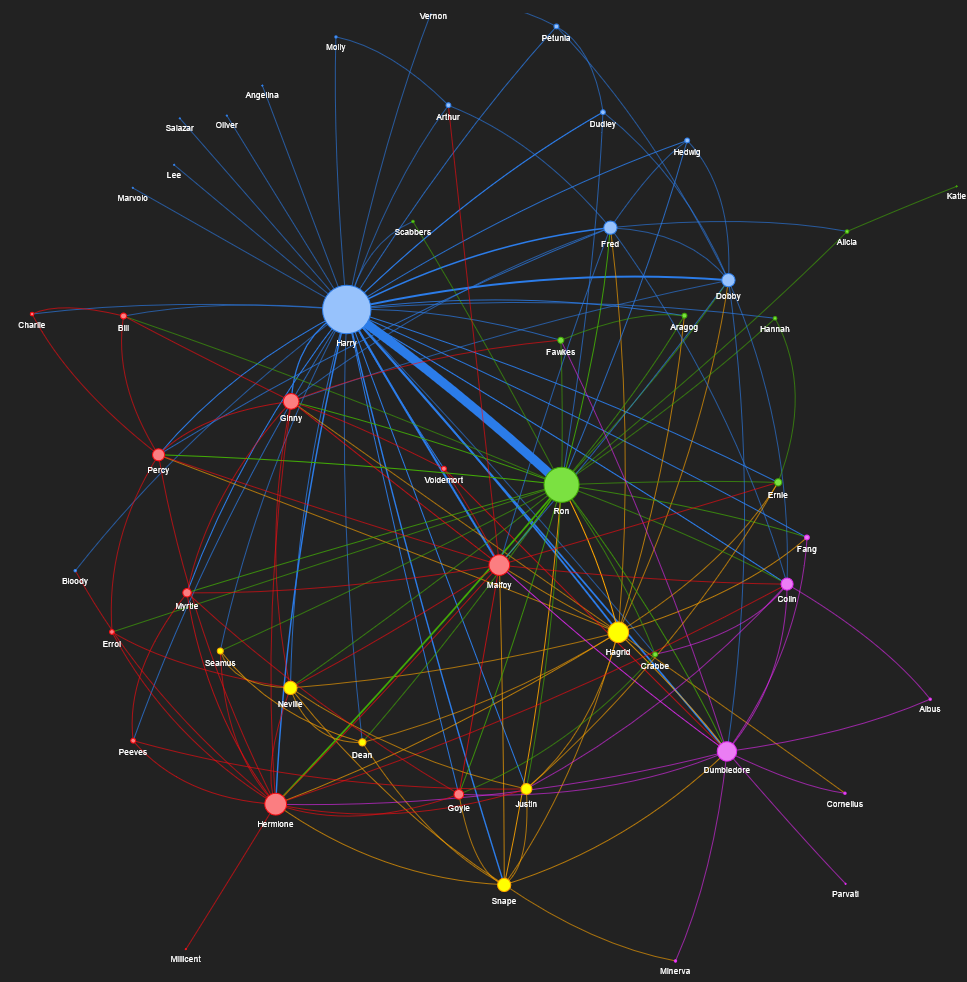
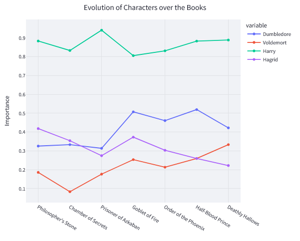

# Graph Network Analysis - Harry Potter 

This repository contains the Harry Potter Graph Network Analysis project! I used Named Entity Recognition (NER) to extract relationships between characters from all seven Harry Potter books, construct a graph network, and analyze the resulting network to discover communities and measure character importance over the course of the series.



## **Overview:**

The goal of this project is to gain insights into the inter-character relationships in J.K. Rowling’s Harry Potter series. By leveraging text analysis techniques and graph algorithms, we can uncover:

* How central or important certain characters are across all seven books.
* Which characters frequently co-occur or are mentioned together.
* Which communities (or clusters) naturally form within the storyline.

## **Try it Yourself:**

Try out the Streamlit visualizations [here!](https://huggingface.co/spaces/AseemD/Graph-Network-Analysis)

## **Methodology:**

* Download the Harry Potter books and scrape character names from wiki.
* Extract named entities using NER.
* Build a graph where nodes represent characters and edges represent relationships or co-occurrences.
* Use community detection to find clusters of strongly related characters.
* Calculate graph metrics (e.g., degree, betweenness) to identify the most important characters.

**Example of Evolution of Characters over Books**


## **Repository Structure:**

```
.
│
├── dataset/
│   ├── books/                  # Text files of the Harry Potter books
│   └── characters/             # Character metadata (aliases, mapping, etc.)
│
├── graphs/       
|   ├── # HTML graphs for each book and combined data
│   ├── 1. Philosopher's Stone.html
│   ├── 2. Chamber of Secrets.html
│   ├── 3. Prisoner of Azkaban.html
│   ├── 4. Goblet of Fire.html
│   ├── 5. Order of the Phoenix.html
│   ├── 6. Half-Blood Prince.html
│   ├── 7. Deathly Hallows.html
│   ├── All Books Combined.html
│   ├── harry_community1.html
│   └── harry.html
│
├── images/                     # Visual assets and figures
|    ├──...
├── pickles/                    # Serialized books
|    ├──...
│
├── app.py                      # Main application file (e.g. web/CLI interface)
├── character_evolution.csv     # CSV tracking character metrics over books
├── Character_Importance.ipynb  # Notebook analyzing character centralities
├── Graph_Network.ipynb         # Notebook for building and visualizing the network
├── readme.md                   # Project overview and documentation
└── utils.py                    # Helper functions for data processing

```